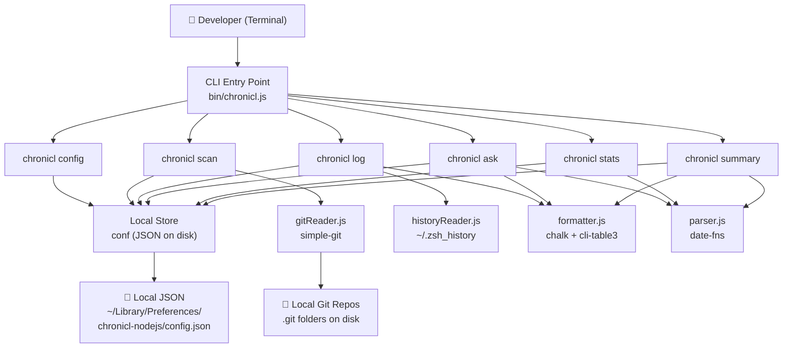
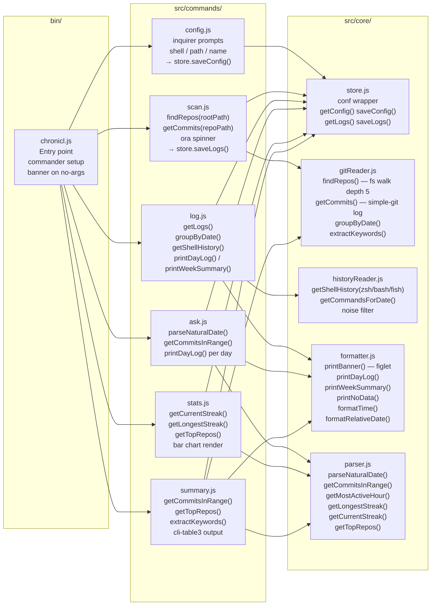
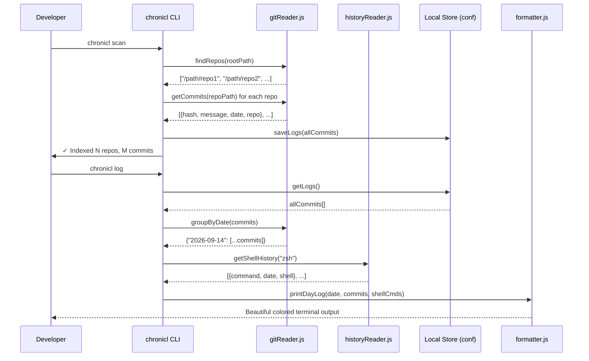

# chronicl 📓

> Your terminal dev journal. Automatically tracks what you built — across every repo, every day.

```
       _                     _      _
   ___| |__  _ __ ___  _ __ (_) ___| |
  / __| '_ \| '__/ _ \| '_ \| |/ __| |
 | (__| | | | | | (_) | | | | | (__| |
  \___|_| |_|_|  \___/|_| |_|_|\___|_|

  your terminal dev journal
```

---

## What is chronicl?

Developers are terrible at remembering what they actually worked on. You finish a big week, your manager asks for a status update, and you're staring at a blank document trying to reconstruct five days of work from memory.

**chronicl** solves this by doing the archaeology for you. It quietly reads your git commit history across all of your local repositories and your shell command history, then stitches it together into a clear, beautiful timeline — organized by day, by week, or by repo.

No forms. No tags. No habits to build. You just code, and chronicl tracks.

Everything runs entirely on your machine. There is no cloud sync, no API keys to manage, and no subscription. Your journal is yours.

---

## Features

- 📁 **Scans all your local git repos automatically** — point it at your projects folder once, it finds everything
- 📅 **Daily and weekly summaries** of your commits, grouped and formatted cleanly
- 🔍 **Ask what you worked on** any given day or week in plain language
- 📊 **Stats** — commit streaks, most active hours, your top repos
- 🐚 **Reads your shell history** for extra context beyond commits
- 💾 **Everything stored locally** — no cloud, no API keys, no subscriptions
- 🎨 **Beautiful terminal output** with colors, ASCII art, and clean tables

---

## Install

```bash
npm install -g chronicl
```

Requires Node.js 18 or later.

---

## Quick Start

```bash
# 1. First-time setup — takes 30 seconds
chronicl config

# 2. Index your repos (walks your projects directory)
chronicl scan

# 3. See what you did today
chronicl log

# 4. See your whole week
chronicl log --week

# 5. Ask about a specific day
chronicl ask "last tuesday"

# 6. Get a weekly wrap-up summary
chronicl summary

# 7. View streaks and patterns
chronicl stats
```

---

## Commands

| Command | Description | Example |
|---|---|---|
| `config` | Interactive first-time setup | `chronicl config` |
| `scan` | Index all git repos in your projects directory | `chronicl scan` |
| `log` | Show today's journal entries | `chronicl log` |
| `log --week` | Show this week's journal | `chronicl log --week` |
| `log --date <date>` | Show a specific date | `chronicl log --date "sep 14"` |
| `ask <query>` | Ask what you worked on in plain language | `chronicl ask "last monday"` |
| `summary` | Weekly wrap-up across all repos | `chronicl summary` |
| `stats` | Commit streaks, active hours, top repos | `chronicl stats` |

---

## Architecture

### High-Level Design (HLD)



---

### Low-Level Design (LLD)



---

### Data Flow



---

### File Structure

```
chronicl/
├── bin/
│   └── chronicl.js          ← CLI entry point, command wiring
├── src/
│   ├── cli.js               ← commander program setup
│   ├── commands/
│   │   ├── config.js        ← Interactive setup wizard
│   │   ├── scan.js          ← Repo discovery & indexing
│   │   ├── log.js           ← Daily / weekly journal view
│   │   ├── ask.js           ← Natural language date queries
│   │   ├── stats.js         ← Streak & activity dashboard
│   │   └── summary.js       ← Weekly standup wrap-up
│   └── core/
│       ├── store.js          ← conf wrapper (local persistence)
│       ├── gitReader.js      ← Repo finder + commit parser
│       ├── historyReader.js  ← Shell history parser
│       ├── formatter.js      ← All terminal output / chalk UI
│       └── parser.js         ← Date parsing + stats logic
├── tests/
│   ├── gitReader.test.js
│   ├── formatter.test.js
│   └── parser.test.js
└── package.json
```

---

## Tech Stack

| Library | Purpose |
|---|---|
| `commander` | CLI argument and command parsing |
| `chalk` | Terminal colors and styling |
| `ora` | Loading spinners during scan |
| `conf` | Local persistent JSON config storage |
| `simple-git` | Reading git commit history |
| `cli-table3` | Pretty terminal tables |
| `date-fns` | Date arithmetic and formatting |
| `figlet` | ASCII art banner |
| `inquirer` | Interactive setup prompts |

---

## How It Works

1. **`chronicl config`** saves your projects directory path, shell type, and name locally using [`conf`](https://github.com/sindresorhus/conf).

2. **`chronicl scan`** walks your configured projects directory using `fs.promises`, finds every folder with a `.git` subdirectory (max depth 5), reads commit history from each using [`simple-git`](https://github.com/steveukx/git-js), and stores everything in a local JSON file.

3. **`chronicl log`** reads the cached commits, groups them by date using [`date-fns`](https://date-fns.org/), fetches matching shell history entries, and renders a clean timeline using [`chalk`](https://github.com/chalk/chalk) and [`cli-table3`](https://github.com/cli-table/cli-table3).

4. **`chronicl ask`** parses your natural-language query (e.g. `"last tuesday"`, `"2 days ago"`, `"this week"`) into a `{ from, to }` date range using `date-fns`, then filters the indexed commit history to that window.

5. **Shell history** is read directly from `~/.zsh_history`, `~/.bash_history`, or the fish history file depending on what you configured. Timestamps are parsed from the ZSH extended history format.

6. **All data** is persisted locally in a JSON file managed by `conf`. Nothing ever leaves your machine.

---

## Running Tests

```bash
node --test tests/gitReader.test.js
node --test tests/formatter.test.js
node --test tests/parser.test.js
```

All 13 tests pass with native `node:test` — no external test framework needed.

---

## Contributing

```bash
# Clone the repo
git clone https://github.com/swagatobauri/terminal_project.git
cd terminal_project/chronicl

# Install dependencies
npm install

# Run the CLI locally
node bin/chronicl.js config

# Link globally for local testing
npm link

# Run tests
node --test tests/*.test.js
```

Please keep PRs focused — one feature or fix per PR. Code should be readable and lightly commented.

---

## License

MIT — do whatever you want with it.
